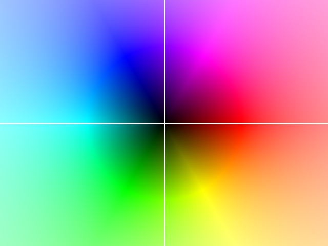
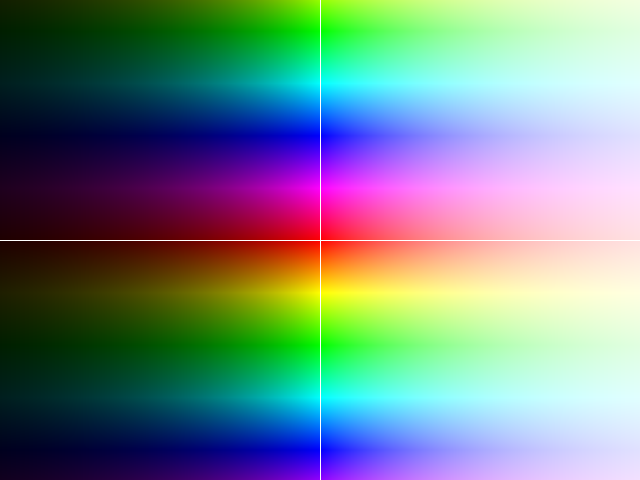

# plotcomplex

> Plot animations of complex-valued functions

I wanted to know how quadratic functions behave and look like,
in general, for complex-valued arguments.
Short answer: [like this](quadratic.mkv?raw=true)!

I was getting fed up with Wolfram Alpha not plotting it like I want,
and lacking any kind of interactivity.
I wanted interactivity in order to explore the argument space,
so I satisfied this itch by implementing animation, but not interactivity.

This code can be used to visualize other kinds of functions, too!
See [Usage](#usage).

## Table of Contents

- [Background](#background)
- [Usage](#usage)
- [TODOs](#todos)
- [Contribute](#contribute)

## Background

So we want to analyze a complex function `f: \mathbb{C} \mapsto \mathbb{C}`.
Visually, we represent this as the image `g: \mathbb{R}^{2} \mapsto \mathbb{R}^{3}`,
where the input is the pixel position (`x,y` represents essentially `x + yi`,
plus some scaling and centering), and the output is the RGB value of the image.

Complex values are translated into RGB like this: The magnitude (absolute value) is taken as brightness,
and the phase (angle) as the hue.
Note that I use only an approximation of the HSB color space, as it is slightly nicer in my eyes.

Here's what the identity function looks like, with `0` in the center, `+1` on the right (east),
and `+i` on the bottom (south):

## Usage

Here's how you can visualize your own function:
- If it doesn't take any parameters, just overwrite the definition of the
  function `f` in the source code, and invoke as `./plotcomplex.py 0 1` to render it.
- If it takes at most two parameters, just use the existing ones, and do `make clean && make -j4`.
  The paramets are animated to provide a good intuition of the behavior on `[-1,1]×[-1,1]`.
- If it takes more than two parameters, you will need to adapt the signature of `f` and rewrite `gen_param`.
  The rest stays the same.

Note that the python script is very slow, and `make` is used to execute it in parallel.

The white lines indicate the parameters.
The vertical line indicates `a`, which is used as the linear coefficient,
and the horizontal line indicates `b`, used as the constant coefficient.
Note that `a` and `b` are real-valued, so the intersection point does not indicate anything meaningful.

Here's another example for complex exponentiation:

And one for multiplication:

## TODOs

- Implement in a faster way.  Rust?

## Contribute

Feel free to dive in! [Open an issue](https://github.com/BenWiederhake/plotcomplex/issues/new) or submit PRs.
